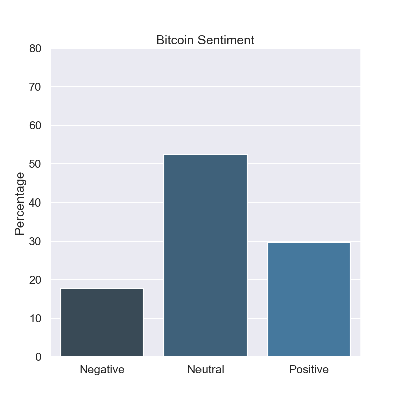
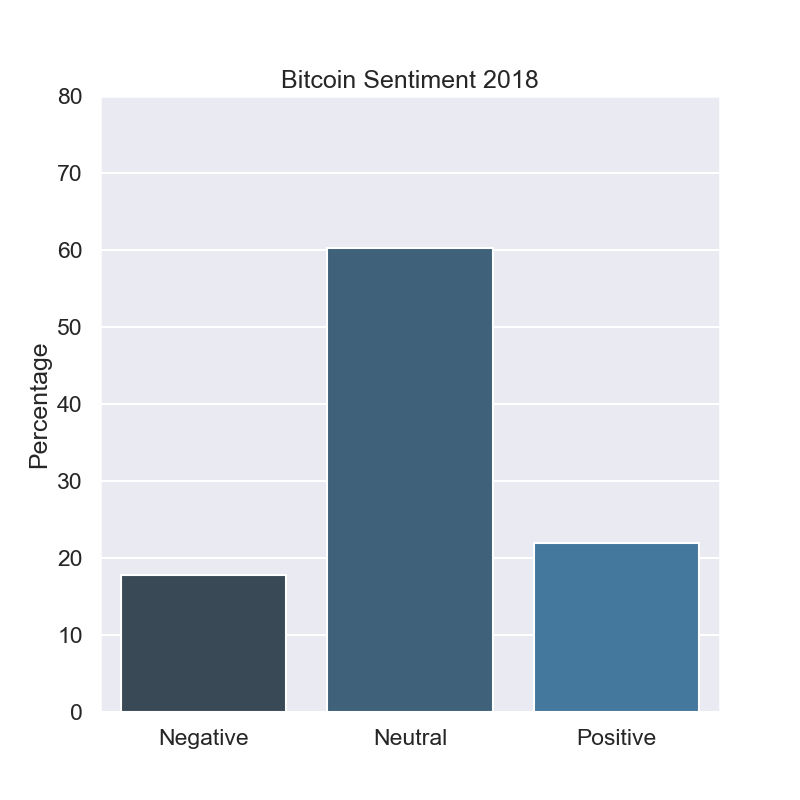
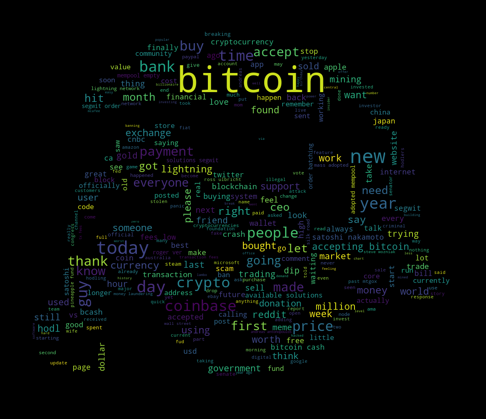
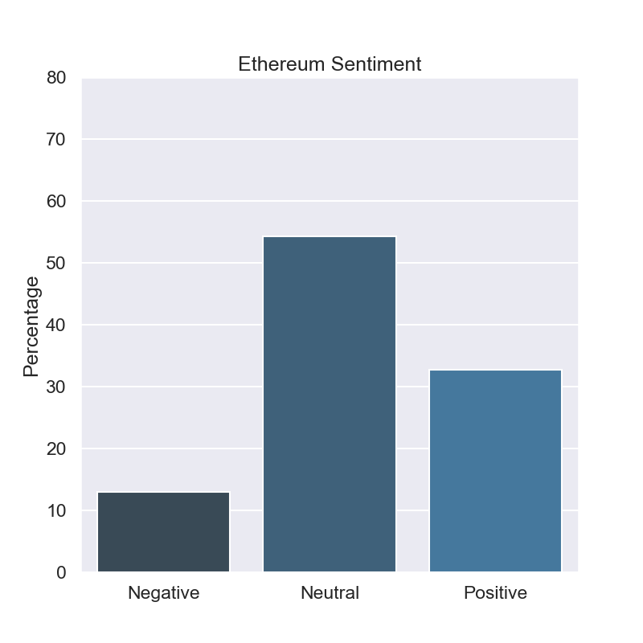
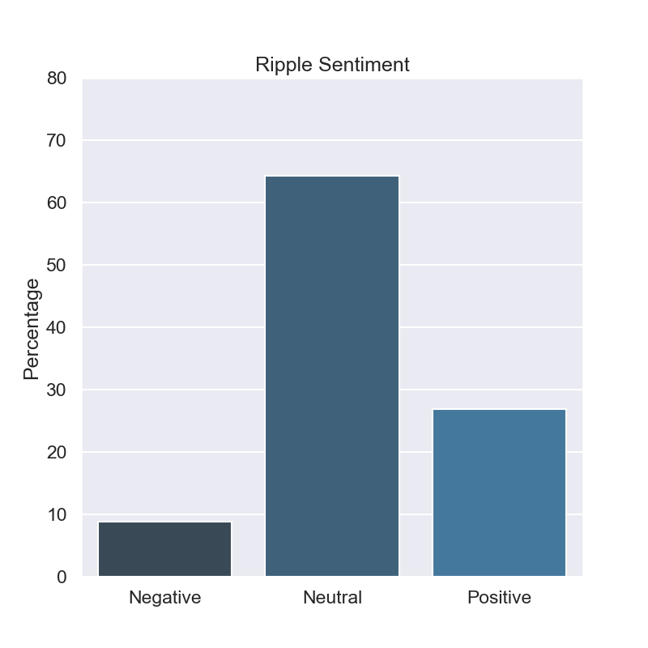
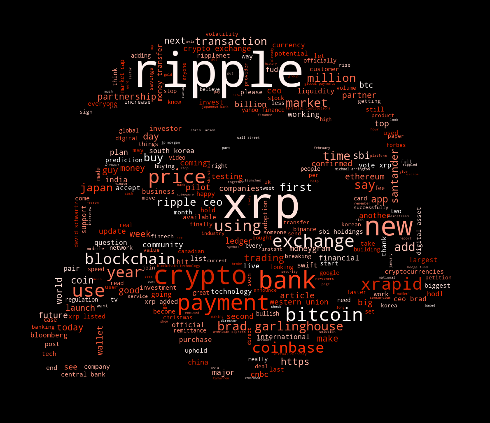

[](http://quantlet.de/)

## [](http://quantlet.de/) **DEDA_Class_SS2018_BitcoinReddit** [](http://quantlet.de/)

```yaml


Name of Quantlet:  DEDA_Class_SS2018_BitcoinReddit

Published in:      "Digital Economy and Decision Analytics (SS 18)"

Description:       "Analysing Sentiment of Subreddits"

Keywords:          "Sentiment, Wordcloud, Word Frequency, Web Scraping"

Author:            Constantin Hackober

Submitted:         Wed, July 25 2018 by Constantin Hackober 

Datafile: PY Script
```















### PYTHON Code
```python

#Bitcoin 

# Import Reddit API Praw 

import praw

# More imports

import pandas as pd

import nltk
from nltk.tokenize import word_tokenize
from nltk.corpus import stopwords
from nltk import tokenize
from nltk.sentiment.vader import SentimentIntensityAnalyzer as SIA
from nltk.stem import WordNetLemmatizer

from textblob import TextBlob
import seaborn as sns

import matplotlib.pyplot as plt

from wordcloud import WordCloud, STOPWORDS
import random

from PIL import Image
import numpy as np
from IPython import display
import math
from pprint import pprint


# Sign in Reddit App 

reddit = praw.Reddit(client_id='iXHQp4dXuQQ2aw', \
			client_secret='3YrPoEb1CY0hylpMru_e_7KmVB4', \
			 user_agent='RedditSentiment', \
			 username='deda2018', \
			 password='deda2018')

# Choose Subreddit and Category 

subreddit = reddit.subreddit('Bitcoin')

top_subreddit = subreddit.top(limit=1000)


# Define text 

textList = []

for submission in top_subreddit:
    textList.append(str(submission.title))

text = ' '.join(textList)


# Prepare text 

words = word_tokenize(text)

stopwords = nltk.corpus.stopwords.words('english')

newStopWords = ['i','like','this','one','us','get']

stopwords.extend(newStopWords)


# Clean text

filtered_text = []

for word in words:
        if word.lower() not in stopwords:
                filtered_text.append(word)

clean_words = [word.lower() for word in filtered_text if word.isalpha()]

wnl = WordNetLemmatizer()

for word in clean_words:
    wnl.lemmatize(word)

clean_words = [word.replace('btc', 'bitcoin') for word in clean_words]

clean_words = [word.replace('bitcoins', 'bitcoin') for word in clean_words]

#print(clean_words)


# Word Frequency Dictionary

dat = list(clean_words)

dict1 = {}

for i in range(len(dat)):
    word = dat[i]
    dict1[word] = dat.count(word)
    continue

keys = list(dict1)

dict2 = dict((k, dict1[k]) for k in clean_words if k in clean_words)

def valueSelection(dictionary, length, startindex = 0): 

    lengthDict = len(dictionary)

    if length > lengthDict:

        return print("length is longer than dictionary length");

    else:

        d = dictionary

        items = [(v, k) for k, v in d.items()]

        items.sort()

        items.reverse()   

        itemsOut = [(k, v) for v, k in items]

    

        highest = itemsOut[startindex:startindex + length]

        dd = dict(highest)

        wanted_keys = dd.keys()

        dictshow = dict((k, d[k]) for k in wanted_keys if k in d)


        return dictshow

# Create plot

dictshow = valueSelection(dictionary = dict2, length = 7, startindex = 0)

n = range(len(dictshow))

plt.bar(n, dictshow.values(), align='center')

plt.xticks(n, dictshow.keys())

plt.title("Most frequent Words BTC")

plt.savefig("Bitcoin_WordFreq.png")

plt.show()

# Create wordcloud

stopwords = set(STOPWORDS)

img = Image.open('stormtrooper.png')

mask = np.array(img)

wc = WordCloud(max_words=300, stopwords=stopwords, mask=mask).generate(" ".join(clean_words))

plt.axis("off")

plt.imshow(wc)

wc.to_file("Bitcoin_wordcloud.png")

plt.show()

# Sentiment Analysis Submissions 

sns.set(style='darkgrid', context='talk', palette='Blues_d')

headlines = set()

for submission in reddit.subreddit('Bitcoin').top(limit=1000):
    headlines.add(submission.title)
    display.clear_output()
    print(len(headlines))
  
from nltk.sentiment.vader import SentimentIntensityAnalyzer as SIA

sia = SIA()

results = []

for line in headlines:
    ripple_score = sia.polarity_scores(line)
    ripple_score['headline'] = line
    results.append(ripple_score)

pprint(results[:3], width=100)

df = pd.DataFrame.from_records(results)

df.head()

df['label'] = 0
df.loc[df['compound'] > 0.2, 'label'] = 1
df.loc[df['compound'] < -0.2, 'label'] = -1
df.head()

df2 = df[['headline', 'label']]
df2.to_csv('reddit_headlines_labels.csv', mode='a', encoding='utf-8', index=False)

print("Positive headlines:\n")
pprint(list(df[df['label'] == 1].headline)[:5], width=200)

print("\nNegative headlines:\n")
pprint(list(df[df['label'] == -1].headline)[:5], width=200)

print(df.label.value_counts())

print(df.label.value_counts(normalize=True) * 100)

fig, ax = plt.subplots(figsize=(8, 8))

counts = df.label.value_counts(normalize=True) * 100

sns.barplot(x=counts.index, y=counts, ax=ax)

ax.set_xticklabels(['Negative', 'Neutral', 'Positive'])
ax.set_ylabel("Percentage")
ax.set_ylim([0,80])

plt.title("Bitcoin Sentiment")

plt.savefig("Bitcoin_Headlines.png")

plt.show()

# Sentiment Analysis 2017 and 2018


def serialize(post):
    """Helper function for converting PRAW objects to python dictionary"""
    result = {}
    for k, v in post.__dict__.items():
        if k.startswith('_'):
            continue
        if k in {'author', 'subreddit'}:
            result[k] = str(v)
            continue
        if v is None:
            continue
        result[k] = v
    return result

submissions = reddit.subreddit('Bitcoin').controversial(limit=None, time_filter="year")

subs = pd.DataFrame(serialize(post) for post in submissions)

pd.set_option('display.max_colwidth', -1)

subs['created_utc'] = pd.to_datetime(subs.created_utc, unit='s')

subs2 = subs[subs.created_utc.dt.year == 2018]


top_2018 = subs2.nlargest(1000, 'score')

final_2018 = top_2018.title.to_string(header=None, index=None)

"""word count

top_2018['word_count'] = top_2018['title'].apply(lambda x: len(str(x).split(" ")))

top_2018[['title','word_count']].head()"""

#Lower case

top_2018['title'] = top_2018['title'].apply(lambda x: " ".join(x.lower() for x in x.split()))

#remove punctuation

#top_2018['title'] = top_2018['title'].str.replace('[^\w\s]','')

#remove stopwords

#top_2018['title'] = top_2018['title'].apply(lambda x: " ".join(x for x in x.split() if x not in stopwords))

#spelling correction

top_2018['title'][:5].apply(lambda x: str(TextBlob(x).correct()))

#TextBlob sentiment

top_2018['sentiment'] = top_2018['title'].apply(lambda x: TextBlob(x).sentiment[0] )

#print(top_2018[['title','sentiment']])

# Create plot

sia = SIA()

sns.set(style='darkgrid', context='talk', palette='Blues_d')

df = pd.DataFrame.from_records(top_2018)

df.head()

df['label'] = 0
df.loc[df['sentiment'] > 0, 'label'] = 1
df.loc[df['sentiment'] < 0, 'label'] = -1
df.head()

df2 = df[['title', 'label']]
df2.to_csv('Bitcoin_headlines_labels.csv', mode='a', encoding='utf-8', index=False)

fig, ax = plt.subplots(figsize=(8, 8))

counts = df.label.value_counts(normalize=True) * 100

sns.barplot(x=counts.index, y=counts, ax=ax)

ax.set_xticklabels(['Negative', 'Neutral', 'Positive'])
ax.set_ylabel("Percentage")
ax.set_ylim([0,80])

plt.title("Bitcoin Sentiment 2018")


plt.savefig("Bitcoin_SentContro_2018.png")

plt.show()


#2017

subs2 = subs[subs.created_utc.dt.year == 2017]


top_2017 = subs2.nlargest(1000, 'score')

final_2017 = top_2018.title.to_string(header=None, index=None)

#word count

top_2017['word_count'] = top_2017['title'].apply(lambda x: len(str(x).split(" ")))

top_2017[['title','word_count']].head()

#Lower case

top_2017['title'] = top_2017['title'].apply(lambda x: " ".join(x.lower() for x in x.split()))

#remove punctuation

#top_2017['title'] = top_2017['title'].str.replace('[^\w\s]','')

#remove stopwords

#top_2017['title'] = top_2017['title'].apply(lambda x: " ".join(x for x in x.split() if x not in stopwords))

#spelling correction

top_2017['title'][:5].apply(lambda x: str(TextBlob(x).correct()))

#TextBlob sentiment

top_2017['sentiment'] = top_2017['title'].apply(lambda x: TextBlob(x).sentiment[0] )

#print(top_2017[['title','sentiment']])

#creating plot
sia = SIA()

sns.set(style='darkgrid', context='talk', palette='Blues_d')

df = pd.DataFrame.from_records(top_2017)

df.head()

df['label'] = 0
df.loc[df['sentiment'] > 0, 'label'] = 1
df.loc[df['sentiment'] < 0, 'label'] = -1
df.head()

df2 = df[['title', 'label']]
df2.to_csv('reddit_headlines_labels.csv', mode='a', encoding='utf-8', index=False)

fig, ax = plt.subplots(figsize=(8, 8))

counts = df.label.value_counts(normalize=True) * 100

sns.barplot(x=counts.index, y=counts, ax=ax)

ax.set_xticklabels(['Negative', 'Neutral', 'Positive'])
ax.set_ylabel("Percentage")
ax.set_ylim([0,80])

plt.title("Bitcoin Sentiment 2017")


plt.savefig("Bitcoin_SentContro_2017.png")

plt.show()

"""Positive headlines:

["My wife knows that I've been wanting to invest in bitcoin again, but we've been quite poor for the past couple years. So she's been investing a few dollars out of her paycheck everytime she got "
 "paid so she could surprise me. It's not a lot, but it's ours and I love her",
 'Some words for my friends',
 'These adorable little girls just sold me snickerdoodles for Bitcoin in San Francisco. I asked them to say cheese for the internet :) (x-post r/pics)',
 'Found a helpful infographic. Could be handy to respond with this when people forget what Bitcoin is called...',
 'South Korean gov\'t "shocked" at the number of citizens requesting the removal of Justice Minister and Finance Minister for market manipulation']

Negative headlines:

['"China banning Bitcoin. Venezuelans surviving off of illegal mining. Time to take Bitcoin seriously as censorship resistant money, not cheap payments"',
 'If this is your first time seeing bitcoin under attack it might look scary. For those of us who have been here for years we know this too will pass with bitcoin emerging stronger.',
 "One of the world's biggest banks just admitted bitcoin could destroy existing finance firms",
 'Undercover Agents Working on Silk Road Case Charged with Theft and Money Laundering',
 'How it feels trying to sell high and buy low']"""


```

automatically created on 2018-09-04