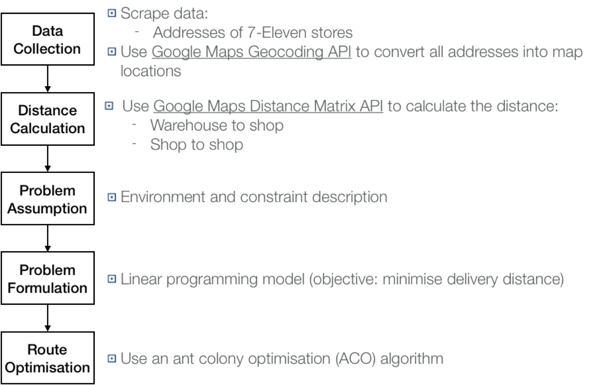

# Using Ant Colony Optimisation for Logistic Route Planning: #
## A Case for Logistic Distribution of 7-Eleven Stores in the Xinyi District of Taipei ##
----------
### Introduction ###
Taiwan had the second highest ratio of convenience stores per population in 2017. According to the statistics department of the Ministry of Economic Affairs (MOEA), there were 10,662 different convenience stores at the beginning of March 2017. On average 2,211 people around the country shares one convenience store. Convenience stores play a critical role in Taiwanese everyday life.
Having high variety and operating 24/7, frequent replenishment is required for the retailers in Taiwan. However, due to the high density of stores, the logistic networks for replenishment are relatively complex. In this project, we use the replenishment delivery of 7-Eleven stores in the Xinyi District as an example and apply ant colony optimisation (ACO). ACO is a population-based evolutionary algorithm to plan the logistic route for minimising travel distance for delivery vehicles. The vehicles are required to travel to all stores (travelling salesman problem, TSP) and finally return to the warehouse, which is also the starting point for the delivery route. The store information (e.g., store id, address) is obtained from the [7-Eleven ibon website](https://www.ibon.com.tw) and the location of warehouse is assumed in the project. The traffic condition is not considered.

There are 63 7-Eleven stores and a warehouse in the Xinyi District. The distribution of 7-Eleven stores and warehouse (plotted by [Folium package](http://folium.readthedocs.io/en/latest/)):

[Xinyi District Map](https://cdn.rawgit.com/linminbin/DEDA_Class_SS2018/c3d4e0c8/Min-Bin%20Lin/Route%20Optimisation/xinyi_map/index.html)

### 1. Research Process ###

Figure 1-1 Research flow

### 2. Data Collection and Distance Calculation ###

**File:**
*DataCollection_route_optimisation.py*

#### 2.1 Data Collection ####
There are two set of data: warehouse and shop. Each data entry has six elements: name, address, entry_id, entry_type (warehouse or shop), latitude(lat), and longitude(lon). This information is stored in the dictionary. Below is an example for representation of data entry:

- warehouse 0 (倉庫) at address 台北市忠孝東路四段560號 (25.0407381, 121.5637989)

The warehouse location is assumed as "台北市忠孝東路四段560號" and store data is scraped from the 7-Eleven website by requests.post with url_data "strTargetField" and "strKeyWords" to specify requested data.

#### 2.2 Distance Calculation ####
Before distance calculation, we need to convert all addresses into geocodes, which include latitude and longitude in order to  represent the location accurately and plot maps. The geocoding and distance calculation are computed by [Google Maps Geocoding API](https://developers.google.com/maps/documentation/geocoding/start?hl=zh-tw) and [Google Maps Distance Matrix API](https://developers.google.com/maps/documentation/distance-matrix/intro?hl=zh-tw), respectively. The Google Maps API only allow  2,500 free requests per day in total. To avoid over-requesting data, we use the [Dill package ](https://pypi.org/project/dill/) to pickle the data, saving it to disk in a format that is readable by the program. This means that once the data is fetched once, the program can be re-ran without further API requests.

### 3. Problem Assumption ###
- The vehicle has to travel to all the stores in the Xinyi District and then return to the start place (warehouse).

- The traffic condition is not considered.

- The types of delivery vehicles and gasoline consumption are not considered.

- Every route is considered to visit every store.

### 4. Problem Formulation ###
The problem (TSP) is formulated as below:

subject to

where d𝒊𝑗 represents the actual distance from  location 𝒊 to location 𝑗. ğ‘¥ğ’Šğ‘— is a dummy variable. If ğ‘¥ğ’Šğ‘— = 1, the path goes from  location 𝒊 to location 𝑗; otherwise, the path does not go from location 𝒊 to location 𝑗. ğ‘¢ğ’Š and 𝑢j  are the sequence number of location 𝒊 and location 𝑗 in the tour, respectively.

The equation (1) is the sum of the distance for the delivery route that travels from location 1 (warehouse) to all the stores. The equation (2) and equation (3) limit the travel such that travel from location 𝒊 to location 𝑗 can only have "one ending location" and "one starting location." The equation (3) proves that every feasible solution contains only one closed sequence of locations,  it suffices to show that every subtour in a feasible solution passes through location 1. The equation (5) is the Miller-Tucker-Zemlin (MTZ) constraint, which eliminates the subtours.

### 5. Route Optimisation ###
#### 5.1 Ant Colony Optimisation (ACO) ####

**File:**
*ACO_route_optimisation.py*

ACO was initially proposed by  Marco Dorigo (1992). It is a metaheuristic algorithm for finding optimal paths, based on the simulation of the foraging behaviour of a colony of searching ants. After an ant finds food, it generates pheromones on the way back to the nest to inform other ants of the path to the food. The pheromones fade over time and the unused paths become less likely to be taken; paths with a higher pheromone concentration are more likely to be taken.

Figure 5-1 Shortest path found by an ant colony

Source: Johann Dréo (https://commons.wikimedia.org/wiki/File:Aco_branches.svg)

In this project, we implement the Max-Min Ant System (MMAS) (Stützle and Hoos, 1996) in which we only update pheromones by Δğœğ’Šğ‘— = q/𝒅BestTour for the best ant at the iteration (q controls the degree of influence of Δğœğ’Šğ‘—. If the path is unused, the the density of pheromones is decreased by ρ (a given initial parameter).  

Additionally, the selection of the next path is based on the probability constructed by the pheromones. The probability of ant k at location 𝒊 chooses to go to location 𝑗 is as follows:

where α and β determine the pheromone trail and the heuristic information; ğœğ’Šğ‘— and ηğ’Šğ‘— are the pheromone trail and the locally available heuristic information, respectively. ğ‘¿ğ’Š are all  the feasible (visitable) locations of ant 􏰯k.

The local search tries to swap the sequence of the tour at various points (e.g., 1-2-3-4 to 3-4-2-1.) to determine if a different sequence can generate better fitness values (shorter distance).

Figure 5-2 The process of ant colony optimisation

#### 5.2 Application and Result ####
**File:**
*Application_route_optimisation.py* (main execution file)

The parameter setting for the project(based on the literature):

- Initial place (init_place) = 'warehouse 0'
- Number of iterations of the ACO (num_iters) = 2,000
- Number of ants (num_ants) = 50 (also called population)
- α (alpha) = 1
- β (beta) = 3
- ρ (rho) = 0.3
- q = 80

The optimised route distance is 40,307 m. The optimisation process of ACO is shown as below:

Figure 5-3 Optimisation process

The final logistic route is demonstrated by the map (plotted by [Folium package](http://folium.readthedocs.io/en/latest/)):

[Route Map](https://cdn.rawgit.com/linminbin/DEDA_Class_SS2018/07a1a29c/Min-Bin%20Lin/Route%20Optimisation/index.html)

### 6. Reference ###

- Blum, C. (2005). Ant colony optimization: Introduction and recent trends. Physics of Life reviews, 2(4), 353-373.
- Le, T. Q., & Pishva, D. (2015, July). Optimization of convenience stores' distribution system with web scraping and Google API service. In Advanced Communication Technology (ICACT), 2015 17th International Conference on (pp. 596-606). IEEE.
- Stützle, T., & Hoos, H. H. (2000). MAX–MIN ant system. Future generation computer systems, 16(8), 889-914.
- Wikipedia: Ant colony optimization algorithms. FL: Wikimedia Foundation, Inc. Retrieved June 16, 2018, from https://en.wikipedia.org/wiki/Ant_colony_optimization_algorithms.
