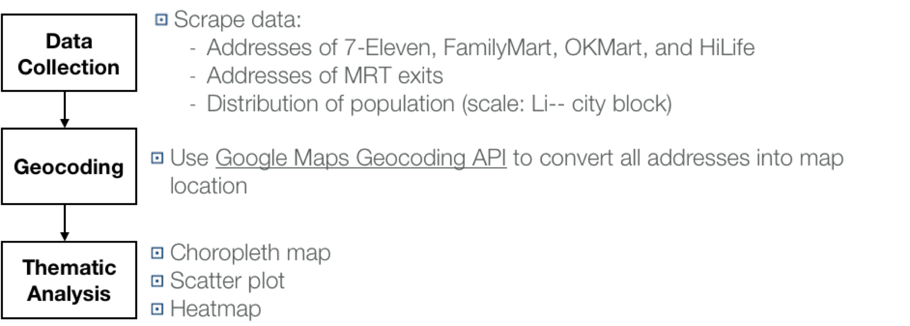

# Using Folium Package for Site Location Selection  #
## A Case for New-entry Retailers to the Xinyi District of Taipei ##
----------
### Introduction ###
Taiwan had the second highest in the world for the ratio of convenience stores per population in 2017. 7-Eleven had 5,221 locations in Taiwan, with 767 listed just in the city of Taipei. FamilyMart had more than 3000 outlets across the country, and HiLife and OKMart were also found throughout Taiwan. The retailer market is extremely competitive. As a result, it is considerably difficult for a new-entry retailer to start the business and overcome the barriers built by existing retailers. In this project, we consider the store distribution of four main convenience stores: 7-Eleven, FamilyMart, HiLife and OKmart, distribution of population and MRT exits in Xinyi District to build a thematic map as a reference for new-entry retailers to select new store locations.

### 1. Research Process ###

Figure 1-1 Research flow

### 2. Data Collection ###
In this project, there are three categories of data required to be collected: stores (7-Eleven, FamilyMart, HiLife and OKmart) , MRT exits, and distribution of population. Having different types of data (e.g., website, geojson, pdf), the project has to apply various packages to scrape or decode the information that is available.

#### 2.1 Store Data ####
Each store entry has six elements: name, address, entry_id, entry_type (7-Eleven, FamilyMart, HiLife, and OKmart), latitude(lat), and longitude(lon). The data of the four  convenience stores is obtained by:
1. [7-Eleven](https://www.ibon.com.tw/retail_inquiry_ajax.aspx): The data of 7-Eleven is scraped from the ibon website by requests.post with url_data "strTargetField" and "strKeyWords" to specify requested data
2. [FamilyMart](http://www.family.com.tw/marketing/inquiry.aspx): The data of FmailyMart is scraped from FamilyMart website by requests.get with adding headers to solve blocking.
3. [HiLife](http://www.hilife.com.tw/storeInquiry_street.aspx):
The data of HiLife is scraped by using [Selenium package](http://selenium-python.readthedocs.io) to create a virtual robot with Firefox() to select required tags in the dropdown lists and then obtain data.  
4. [OKmart](http://www.okmart.com.tw/convenient_shopSearch): The data of OKmart is scraped by request.get.

Except for the FamilyMart data, the stores need to be geocoded via [Google Geocoding API](https://developers.google.com/maps/documentation/geocoding/start?hl=zh-tw) to convert the addresses into latitude/longitude pairs.

#### 2.2 MRT Exit Data ####
The MRT exit data is obtained from [Data.Taipei](http://data.taipei/opendata/datalist/datasetMeta?oid=cfa4778c-62c1-497b-b704-756231de348b). Since the data set includes the exit information in the whole Taipei city, we use the polygon information [Shapely package](https://pypi.org/project/Shapely/) to find the exits in the Xinyi District.

#### 2.3 Population ####
The data of distribution of population (scale: Li-- city block) is obtained from the [Household Registration Office](https://xyhr.gov.taipei/Content_List.aspx?n=B38A8F9293AD70BD). The data is preserved in a PDF file. We use [pdfplumber package](https://github.com/jsvine/pdfplumber) to extract the information that is readable with Python.

### 3. Thematic Analysis ###
The thematic analysis combines a choropleth map, scatter plot, and heatmap.

First, we use "choropleth" in the [Folium package](http://folium.readthedocs.io/en/latest/) to display population distribution at the district's subdivisions (Li) in the Xinyi District with a sequential [colour scheme](http://colorbrewer2.org/#type=sequential&scheme=BuGn&n=3). This requires the geographical data for each Li and the corresponding population data. Second, we overlay the scatter plot of the stores and MRT exits. Finally, according to the distribution of all stores, we plot a heatmap to show the density. The thematic analysis allows control of which layers can be seen on the map.

Below is the thematic analysis map:
[Thematic Analysis](https://cdn.rawgit.com/linminbin/DEDA_Class_SS2018/3760085b/DEDA_Class_SS2018_Route%20Optimisation%20%26%20Site%20Selection/Site%20Selection/xinyi_map.html)
